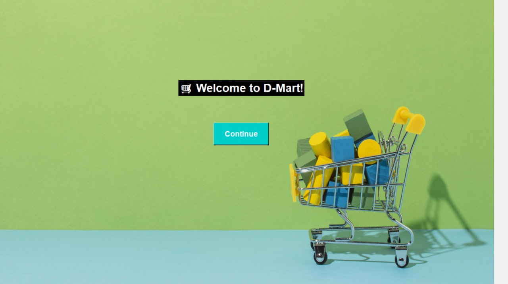
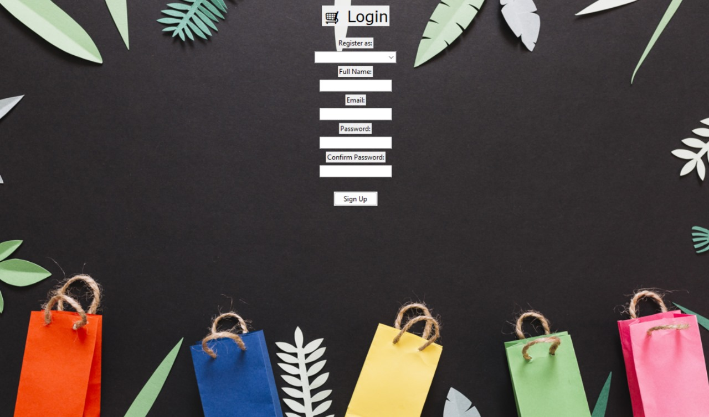
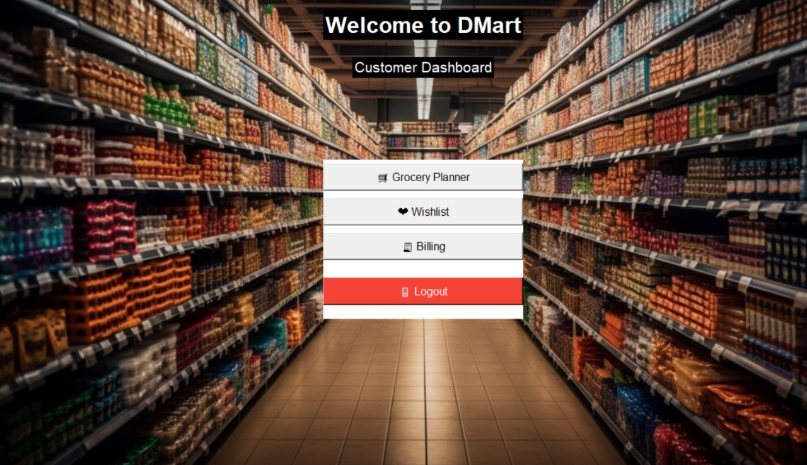
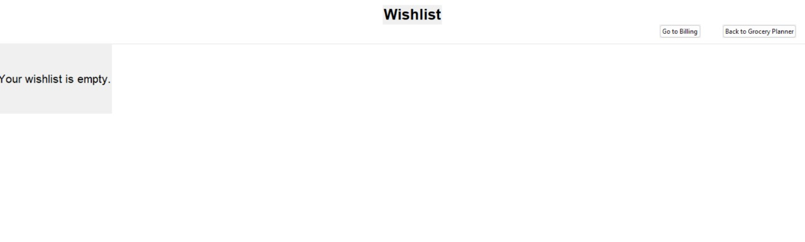
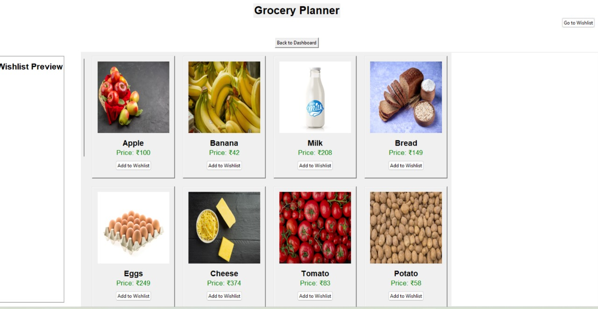
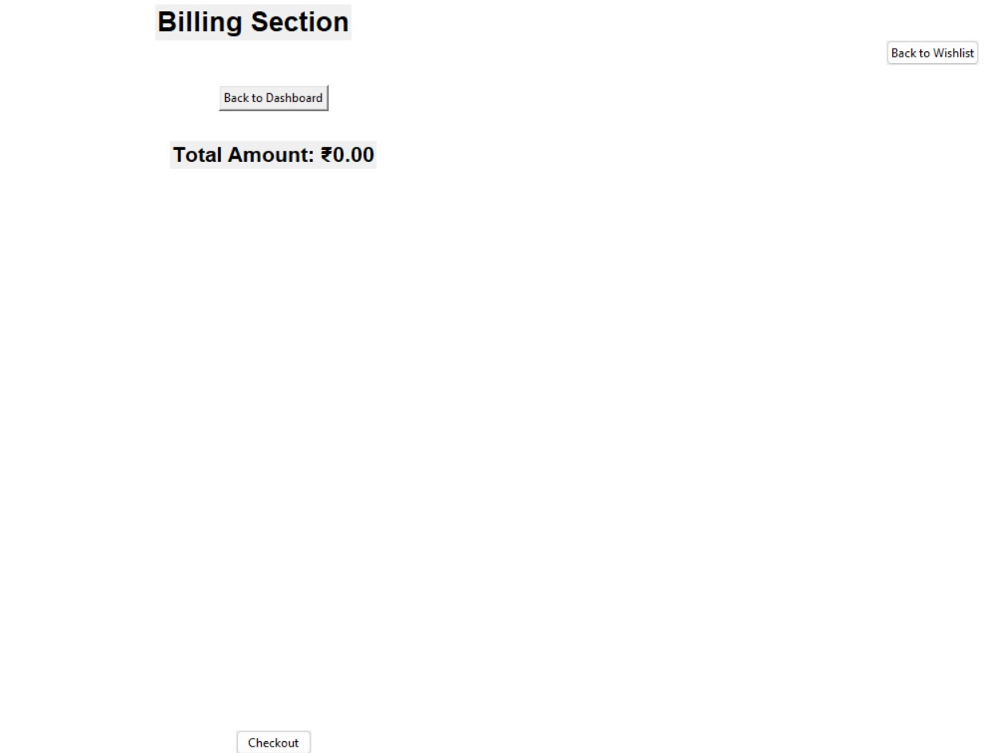
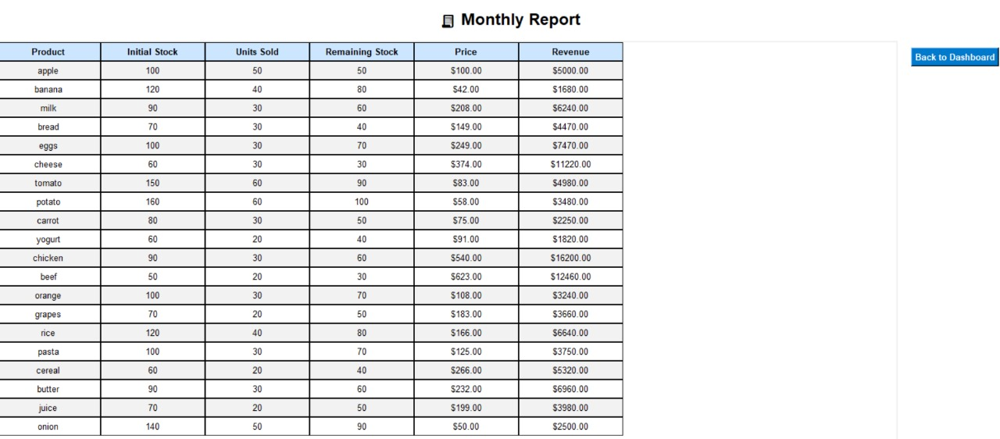

# 🛒 Python Grocery App

A **GUI-based grocery shopping system** built with **Python & Tkinter** featuring wishlist, grocery planning, billing, stock management, offers, and reporting.  

---

# 🚀 Features
- 🏠 Homepage with clean navigation  
- 🔑 User login & authentication  
- 📋 Customer dashboard  
- 💖 Wishlist for quick shopping  
- 📝 Grocery planner  
- 🧾 Billing & checkout system  
- 📦 Stock & inventory management  
- 📊 Monthly sales report  
- 🎟️ Offers & discount coupons  

---

# 🛠️ Tech Stack
- Python 🐍  
- Tkinter 🎨  
- Pillow (PIL) 🖼️  
- Object-Oriented Programming (OOP)  

---

# 🖼️ Screenshots (App Flow)

## 🏠 Homepage  

## 🔑 Login Page  

## 📋 Customer Dashboard  

## 💖 Wishlist  

## 📝 Grocery Planner  

## 🧾 Billing Section  

## 🍎 Stock

## 📊 Monthly Report  

## 🎟️ Offers & Coupons  
  

---

# 📂 Project Structure
python-grocery-app/  
│── app.py               → Main application file  
│── requirements.txt     → Dependencies  
│── README.md            → Project documentation  
└── screenshots/         → UI screenshots  
&emsp; ├── Homepage.jpg  
&emsp; ├── login page.jpg  
&emsp; ├── Customer Dashboard.jpg  
&emsp; ├── Wishlist.jpg  
&emsp; ├── items.jpg  
&emsp; ├── Billing Section.jpg  
&emsp; ├── Stock.jpg  
&emsp; ├── Monthly Report.jpg  
&emsp; └── Offers and Coupons.jpg  

---

